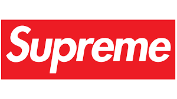
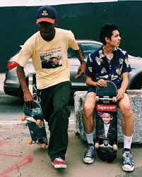

Supreme New York is one of the biggest clothing brands in the entire world, the brand is the king of the streetwear fashion scene and the scarcity of items on a release day means that they often fetch three to five times their initial retail price on the lucrative resale market. Supremes' box logo is recognised worldwide and is often a key selling point for many items that they release, the main features of the logo are the stand out colourway and smooth Futura font, which is also in bold and italicised.

The font deployed for the iconic Supreme logo is Futura Bold Italic font. The man responsible for designing and releasing it for the first time in 1927 was Paul Renner, who designed it via Bitstream. Futura font is a sans serif typeface, made up of geometric shapes - more specifically circles. The distinctive red box logo with "Supreme" in white  "Futura (typeface)")Futura Heavy Oblique is largely inspired by Barbara Kruger's propaganda art - which was heavily anti-establishment, with rebellious connotations.

Initially, the logo was not how it is pictured today, it was initially described by Supreme founder James Jebbia as 'Too flat' so he decided to point his friend who designed the logo in the direction of Barbara Kruger's artwork. The bold white letters clashing against a vibrant red background are intended to portray an anti-capitalist, rebellious message which happened to really resonate with the target audience of New York skaters and their culture.

The Futura Bold Italic Font is so effective against the red background, the boldness represents the notion that the brand is trustworthy, stable and secure, whereas the italics represent the notion where the brand has some flair and a style which is out of the ordinary and shows that Supreme is different to other streetwear brands. Furthermore, the fact that the typeface is Sans Serif connotes the idea that Supreme is not necessarily a luxury brand, but that it is a streetwear brand, made for skaters, who generally, in that time period, were not super rich. If Supreme were to use a serif font, this would portray the idea that they are a high end, luxury brand , similar to the way that Louis Vuitton have designed their logo and font, and many other brands alike. Other business brands have also used the Futura font, such as Mercedes-Benz, Boeing, NASA, Disney, IKEA and many more, conveying the notion that the font gives connotations of trust, hence it is so widely used.

To summarise, Futura epitomises what Supreme is all about as a brand, It's appearance represents efficiency and forwardness - emphasised by the italicised lettering. Furthermore, the wide usage of the font connotes strength and trust, whilst the colours and inspiration for the rest of the logo comes from artwork that represented a rebellious message. All the ingredients that form the perfect streetwear font.