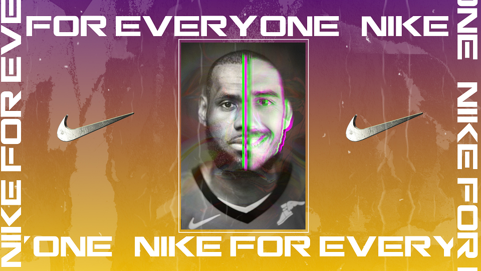

# **About NIKE**

Founded on January 25th 1964, Nike has transformed in to one of the biggest brands in the entire world. The sporting giants were ranked 89th in the 2018 fortune 500 list of the largest US Corporations, ranked by total revenue, and was worth an estimated 30 billion dollars in 2017, despite the font which appeared on the logo only costing $35! Nike are the leading supplier of athletic shoes and apparel and have worked with a range of celebrities including Cristiano Ronaldo, Colin Kaepernick, Kobe Bryant and many many more. 

# **NIKE's Logo**

The Nike logo is one of the most iconic in the world, it has evolved over the years and has traditionally been comprised of the Nike Swoosh and then some lettering above or overlapping the Swoosh, however, this has changed in recent years, as now the Nike Swoosh is so iconic and recognisable globally that they no longer need to have any text naming the brand. 

# NIKE's Font

The Nike logo nowadays is just the swoosh symbol, however, this was not always the case, often accompanying the swoosh in the past was Nike lettering, which changed styles as Nike progressed as a brand, as shown in the above image, initially the Nike font was designed by Carolyn Davidson and this was successful, the font was cursive and all the letters were conjoined, this alludes to the notion that Nike at that time was almost more independent and suggested that the products were more luxurious, in contrast to this, the Nike font of today suggests efficiency and the italicised lettering connotes the notion that the brand is fast and forward facing.

The most recent font appears to be Futura Bold Condensed Oblique with a few minor tweaks, one of these tweaks being that the letter 'K' is slightly slanted to make the text more visible, it was written this way until 1995 when the brand removed the lettering from the logo completely, although it can still be found on many pieces of clothing and footwear, particularly in the football industry where it is often heavily depicted on football boots.

Plenty of other brands were interested in the Futura font in the same era as it stood for values of efficiency and forwardness, obviously key ideals that the brands are trying to portray to their customers, it also connotes a sporty feeling, which is particularly clever when aiming at a target audience of athletes.

Furthermore, the idea of using a sans serif font is also particularly clever from Nike, this suggests that the brand is inclusive and for everyone, and does not convey the idea that the brand is high end or exclusive in any way, in fact it suggests the opposite - that Nike is for everyone, and as often sports are played all over the world, and Nike wants to be the face of sport all over the world - this is a tiny spot of genius from the logo designer.

