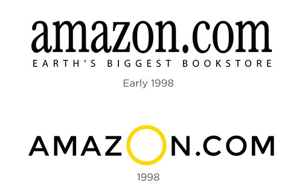

Jeff Bezos is the richest man in the world, owner of Amazon.com, the website we all know and love for delivering packages to your door the next day, and always being there when you need it most. In terms of American information technology it is considered one of the top 4 big companies, alongside Google, Apple and Facebook.

The Amazon logo is one which is recognised worldwide, and there is reason for this, the design is simple, clever and eye catching. A little known secret about the Amazon logo is that it was created to portray the idea that the website sells everything from A-Z, hence why the arrow links the A and the Z together, as well as this, the arrow is also used to create a smile, which is what Amazon wants its users to feel after using their website.

# **Previous Logos**

The Amazon Logo as we know it is made up of a Sans Serif Officina Sans Bold typeface and an arrow underneath, so the font is crucial to the logo's success. However, the Amazon logo (and typeface) has not always been this way and has changed overtime. 

The Early 1998 Logo which is depicted in the above image uses a black serif font, not too dissimilar to the one used in the modern day, and it was then updated to the 1998 model which used a black sans serif font, in my opinion this portrays the notion that Amazon as a brand is not upmarket and exclusive, but it is in fact for everyone to use and it should benefit everyone, whereas the serif font used in Early 1998 connotes the idea of a more upmarket bookstore, which is not what Amazon wanted to come off as with their plans to distribute much more than just books as it transitioned into one of the worlds largest companies.

# **The Modern Day Logo**

The modern day logo as we know it uses the Sans Serif Officina Sans Bold typeface - If we are to really digest this font we can denote that the fact it is Sans Serif as previously mentioned connotes the idea that the brand is not high end or exclusive but that it is for everyone. Furthermore, the notion that the logo uses a bold typeface indicates the point that Amazon is a sturdy and trustworthy brand that you can put your faith in to deliver products on time, whereas a skinny font that perhaps didn't look so sturdy may indicate that the brand is not trustworthy and fragile. It is also worth noting that the Z in the modern day Amazon logo is heightened and has some curvature, this is to further convey the idea of the smile which was previously mentioned, and portrays Amazon's slogan of 'Delivering smiles to doors'. 

All of the above signifies how Amazon have created one of the most reputable logos in the world, and how the font contributes a massive part of this logo - Amazon is the perfect representative of how important a typeface can be to a brand.