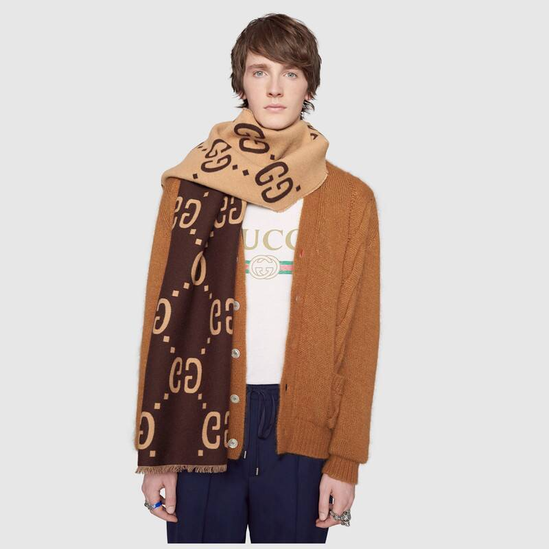

Gucci is a luxury brand of fashion house based in Florence, Italy. It is potentially the biggest high-end Fashion house - In 2020, the brand was valued at approximately $17 billion, in comparison, the brand's valuation was $10 billion in 2019 - so it is clearly growing at quite a rate. 

In 2015, Gucci brought on Alessandro Michele as their new creative director. Under Michele's leadership, Gucci has come to embrace streetwear and the influence of popular culture, Michele specifically has noted the change that logo's are big in current fashion, as we see a return to a 90's Style - this of course works in favour of the new creative director, as the Logo is extremely marketable.

The Gucci Logo is artistically designed, and has been timeless and classic since the design took shape. Now It is the most memorable and recognizable fashion logo ever created. The logo symbolizes grandeur and authenticity and is seen worldwide. The Gucci logo consists of the interlocked double G's and the Gucci wordmark. The interlocked double G's, which is a form of monogram, represents the initials of the founder, Guccio Gucci.

The most commonly known and used Gucci Font is known as Granjon Roman. Granjon Roman is an old fashioned serif style typeface designed by  "George W. Jones (printer)")George W. Jones in the year 1928. Specifically, the notion that it is a serif typeface is what gives it the high end feeling, It also has a very small width in the lettering, this connotes a high-end feeling as it alludes to a luxury style, similar to many brands alike such as Louis Vuitton, Giorgio Armani, Chanel, and Dolce and Gabbana. 

The roman design was from Claude Garamond and the italic version was from Robert Granjon, however, several other Garamond's were on the market in the 1920s, leading to Jones decision to to name his typeface Granjon.