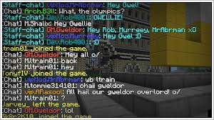

We're coming up to the release of Sony and Microsoft's new consoles, the Xbox Series X and Playstation5, so we thought that wed take a look at the world's best selling Video-Game and the Typeface which is on the front cover and plastered worldwide, even after coming up to its 9th anniversary. Minecraft has over 200 million sales. Minecraft has been critically acclaimed, winning several awards and being cited as one of the ultimate games, of all time. Social media, parodies, adaptations, merchandise, and the annual ['MineCon'](https://en.wikipedia.org/wiki/MineCon "MineCon") conventions played large roles in popularizing the game. 

### The Minecraft Logo

The Minecraft typeface is formulated to have little space between the lettering, uses a 'block type' style, with very rigid edges, and overall has a very square styling, which really reflects the game itself well. 

The word Minecraft is not lined with square paving stones as it was in its initial development but is carved from several cobblestones, cracked on all sides. It is also worth noting that immortalised in the letter 'A' is the Minecraft Creeper, a monster in the game which became a thing of legend during the games rise to success.

The 'Blocky' font which is used (pardon the pun) is a touch of genius from logo designer Hayden Scott-Baron, as it is the perfect way to reflect what the game is all about, as the entire game as I'm sure you're aware is pixelated into 3D Blocks. This combines perfectly with the square format of the lettering for the same reason.

### In Game Text

The In-Game text in Minecraft however is very different to the logo styling and typeface. This is the text which is used for the chat, as well as any other text portrayed on the screen, as seen here.

This text is used because it's very clear to understand, and also retains the games block-type style, it retains the notion of being a pixelated typeface and therefore reflects the other stylistic features in the game.

On the whole the Minecraft Logo and Typefaces are very smartly designed to really mirror what the game is about, crafting blocks, many stylistic features represent this notion, which is why it is so so successful.